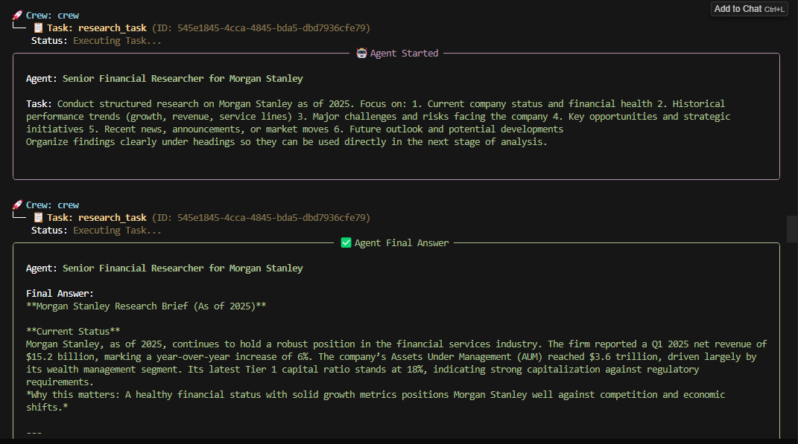
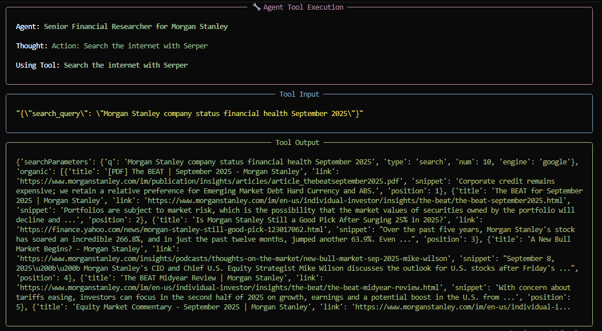
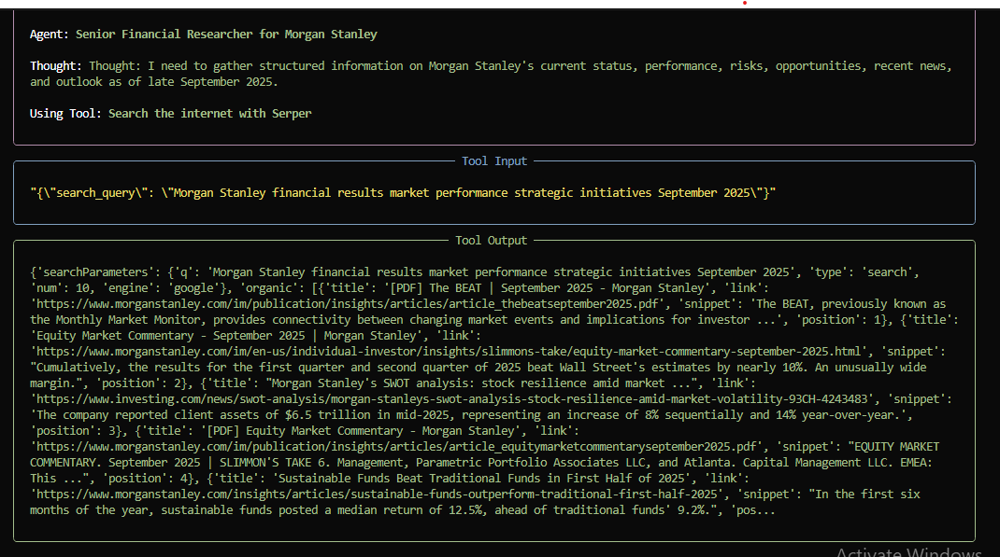
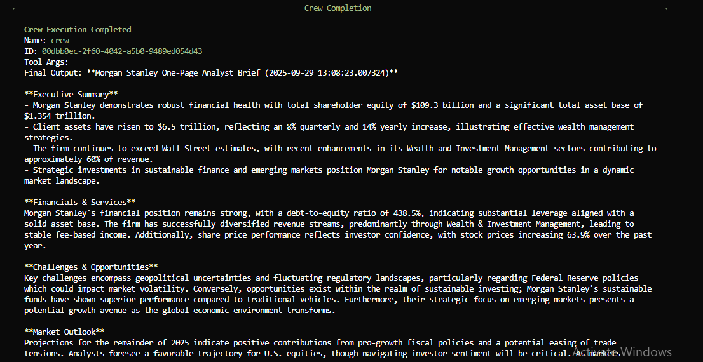
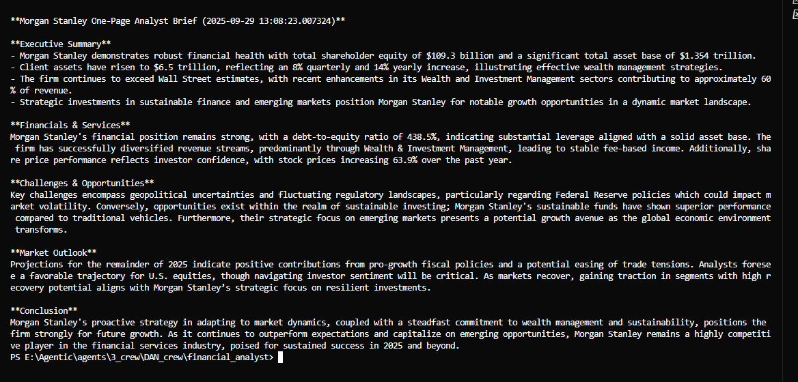

# Financial Analyst CrewAI Project - Morgan Stanley

**Description:**  
AI-powered **Financial Analyst workflow** using **CrewAI, GPT-4o, and Serper API** to automate company research and generate one-page analyst briefs.  

---

## 🔹 Project Summary
This project demonstrates how to apply **agentic AI to financial analysis**, automating the research and reporting process for financial firms. In this case, I focused on Morgan Stanley.

The workflow is designed to simulate the work of a **junior financial analyst**, delivering concise, professional reports that highlight company performance, opportunities, and market outlook; exactly the kind of deliverables recruiters and consulting managers expect to see.  

The system uses two agents:
- **Researcher Agent** → Collects structured insights (financial health, services, risks, opportunities, outlook).  
- **Analyst Agent** → Transforms insights into a **polished one-page financial analyst brief** with executive summary, analysis, and conclusions.
  
The system also uses two tasks
- **Research Task** → Conducts structured research on {company}, gathering insights on financial health, historical performance, key services, risks, opportunities, and future outlook. Produces an organized research brief with clear sections.  
- **Analysis Task** → Reviews the research brief and creates a **polished one-page Financial Analyst Report**. Includes an executive summary, financial highlights, service strengths, market opportunities, and a forward-looking conclusion.  

---

## 🛠️ Technologies Used
- **CrewAI** → multi-agent orchestration  
- **Python** → core implementation  
- **LiteLLM / OpenAI GPT-4o-mini** → natural language generation  
- **Serper API** → live web search for up-to-date financial data  
- **Dotenv** → secure environment variable management  

---

## 📊 Example Outputs

This project can run in two modes:  

### 1. Without Serper API (Offline Mode)
When the crew runs without internet access, the **Researcher Agent** relies only on the model’s built-in knowledge.  
The generated report still follows the correct structure but is based on general knowledge up to the model’s cutoff.  

**Example Screenshots:**  
  
  

---

### 2. With Serper API (Online Mode)
When `SERPER_API_KEY` is provided, the **Researcher Agent** uses **live search** to pull the most recent company information.  
This makes the final financial analyst brief more accurate, up-to-date, and relevant for 2025.  

**Execution Flow:**  
- Research agent queries live data sources  
- Findings are structured into insights  
- Analyst agent turns insights into a professional one-page report  

**Example Screenshots:**  
  
  
  
  
  

---

### 📝 Key Difference
- **Offline Mode** → General analyst report based on stored knowledge.  
- **Online Mode** → Live data integration, producing **reports with current financials, news, and trends (2025)**.

The details in the report may not be accurate. I am trying to improve the program so that it can be updated with accurate information.

